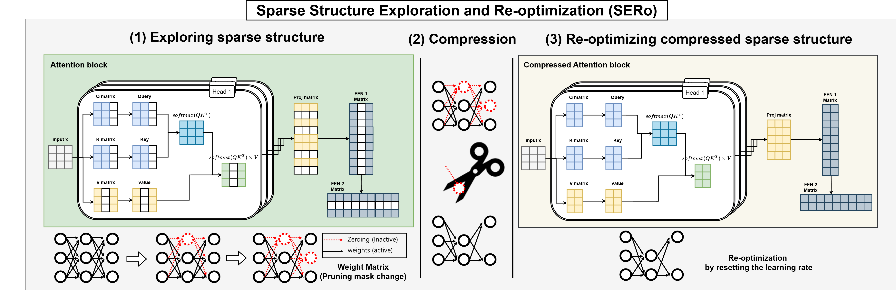

# Sparse Structure Exploration and Re-optimization for Vision Transformer(SERo)

## This repository provides the code for the UAI 2025 paper titled 	
"Sparse Structure Exploration and Re-optimization for Vision Transformer (SERo)" by S. An, J. Kim, K. Lee, J. Huh, C. Kwak, Y. Lee, M. Jin, J. Kim

## Collaboration
This work was conducted in collaboration with Hyundai Motor Company Robotics Team.

## Abstract
Vision Transformers (ViTs) achieve outstanding
performance by effectively capturing long-range
dependencies between image patches (tokens).
However, the high computational cost and memory requirements of ViTs present challenges for
model compression and deployment on edge devices. In this study, we introduce a new framework,
Sparse Structure Exploration and Re-optimization
(SERo), specifically designed to maximize pruning efficiency in ViTs. Our approach focuses on (1)
hardware-friendly pruning that fully compresses
pruned parameters instead of zeroing them out,
(2) separating the exploration and re-optimization
phases in order to find the optimal structure among
various possible sparse structures, and (3) using
a simple gradient magnitude-based criterion for
pruning a pre-trained model. SERo iteratively refines pruning masks to identify optimal sparse
structures and then re-optimizes the pruned structure, reducing computational costs while maintaining model performance. Experimental results indicate that SERo surpasses existing pruning methods across various ViT models in both performance and computational efficiency. For example, SERo achieves a 69% reduction in computational cost and a 2.4x increase in processing
speed for DeiT-Base model, with only a 1.55%
drop in accuracy

